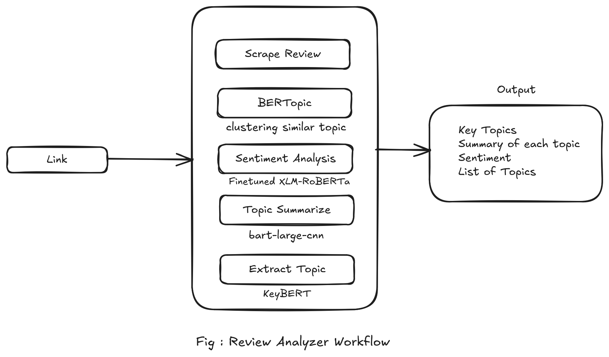
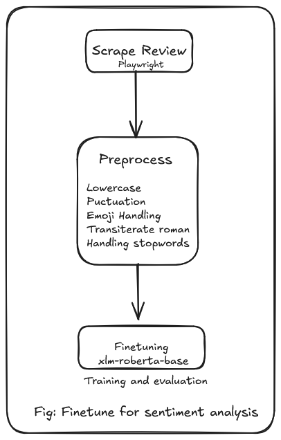

# 🛒 Daraz Review Topic Analyzer

An end-to-end NLP application that scrapes Daraz product reviews, performs **dynamic topic modeling**, **sentiment analysis**, and **topic-wise summarization**, and presents insights through an interactive UI.

The system is designed to work with **English, Nepali, and code-mixed reviews**, making it suitable for real-world Nepali e-commerce data.

---

## 🚀 Features

- Paste any Daraz product URL
- Scrape dynamic reviews
- Automatically group reviews into meaningful topics
- Multilingual topic modeling (English + Nepali + mixed text)
- Sentiment analysis using a fine-tuned model
- Topic-wise review summarization
- Interactive UI with expandable topic sections

---

## 🧠 Tech Stack (with Purpose)

- **BERTopic**  
  Used for **dynamic topic modeling and topic grouping**.  
  It clusters semantically similar reviews using embeddings and extracts interpretable topic representations without predefined labels.

- **SentenceTransformers**  
  Used to **generate dense multilingual embeddings** for reviews.  
  These embeddings capture semantic meaning and are required by BERTopic for accurate clustering.

- **XLM-RoBERTa (Fine-tuned)**  
  Used for **sentiment analysis**.  
  The model is fine-tuned on review data, enabling accurate sentiment detection for multilingual and code-mixed customer feedback.

- **Facebook BART Large CNN**  
  Used for **abstractive summarization**.  
  Generates concise, high-quality summaries for each topic group.

- **Playwright**  
  Used for **scraping Daraz reviews**.  
  Handles JavaScript-rendered and dynamically loaded content that traditional scrapers cannot reliably extract.

- **FastAPI**  
  Used as the **backend service**.  
  Handles scraping and heavy NLP processing while keeping the system modular and scalable.

- **Streamlit**  
  Used for building the **interactive user interface**.  
  Displays topics, summaries, and expandable review sections cleanly.

- **Python**  
  Core language used for orchestration, NLP pipelines, backend logic, and scraping.

---

## 🏗️ System Architecture & Workflow

### 🔄 Overall Workflow Diagram



### Workflow Explanation

1. User pastes a product link into the UI
2. URL is sent to the FastAPI backend
3. Reviews are scraped using Playwright
4. Text is cleaned and normalized
5. SentenceTransformers generate embeddings
6. BERTopic clusters reviews into topics
7. XLM-RoBERTa predicts sentiment per review
8. BART Large CNN summarizes reviews per topic
9. Results are rendered in the Streamlit UI

---

## 🧪 Model Fine-tuning Pipeline

### 🔧 Fine-tuning Diagram

<p align="center">
</p>

### Fine-tuning Process (XLM-RoBERTa)

1. Review dataset collection from e-commerce platforms
2. Text cleaning and normalization
3. Multilingual tokenization using XLM-RoBERTa tokenizer
4. Fine-tuning on labeled sentiment data
5. Evaluation using Accuracy, Precision, Recall, F1-score
6. Deployment inside the FastAPI inference pipeline

---

## ⚙️ Installation

### 1. Clone the repository

```bash
git clone https://github.com/roshan-acharya/Review-Analyzer.git
cd Review-Analyzer
```


### 2. Create virtual environment

```
python -m venv venv
source venv/bin/activate      # Linux / Mac
venv\Scripts\activate         # Windows
```

### 3. Install dependencies

```
pip install -r requirements.txt
```

### 4. Start Backend

```
uvicorn api:app --reload
```

### 5. Start UI

```
streamlit run app.py
```

## ⚠️ Limitations

- Scraping may fail if Daraz blocks automated requests

- Very short reviews may reduce topic quality

- Performance depends on system resources

- Sentiment analysis model is quite imperfect due to low resouce language

## 👤 Author

Roshan Acharya
